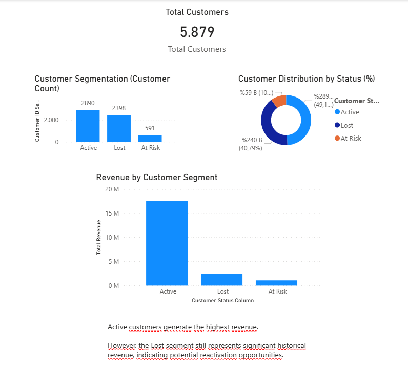
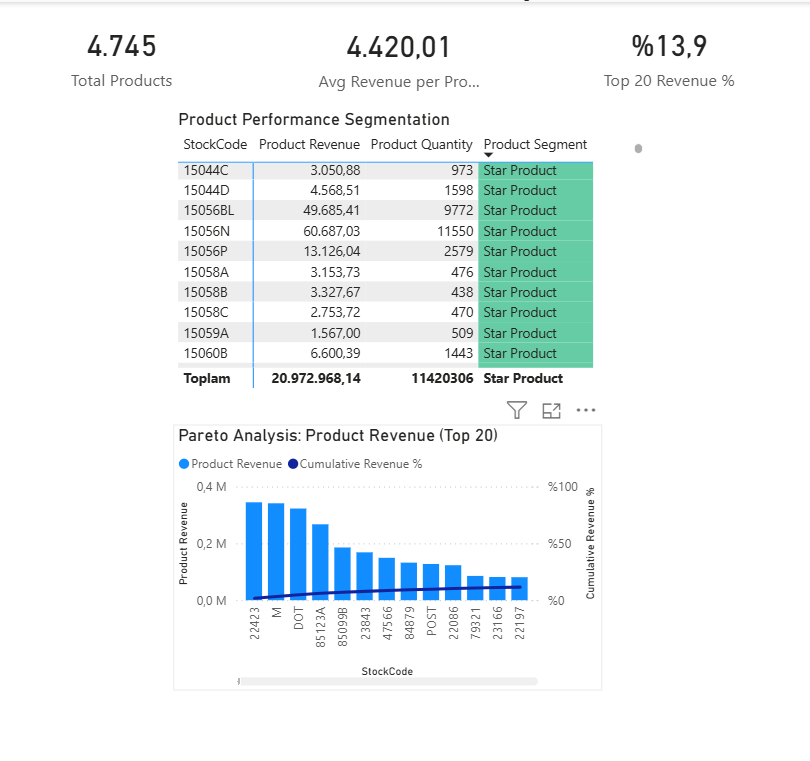

# Retail Sales Business Intelligence Solution – Power BI

---

## 📊 Project Overview

This project is a Business Intelligence solution developed in Power BI using the **Online Retail II** dataset (UK-based e-commerce transactional data).

The objective is to transform raw transactional data into executive-level dashboards that support:

- Revenue performance analysis  
- Customer segmentation  
- Product intelligence  
- Data-driven decision making  

The solution analyzes over **1 million transaction records** and presents structured business insights through three analytical dashboard pages.

---

## 📁 Dataset

**Online Retail II (Kaggle)**  
UK-based e-commerce transactional dataset (2009–2011)

Includes:

- InvoiceNo  
- InvoiceDate  
- Customer ID  
- Quantity  
- UnitPrice  
- Country  

Clean dataset size: ~1,041,000 rows

---

## 🛠 Data Preparation

- Appended 2009–2010 and 2010–2011 datasets  
- Removed returns (negative quantities)  
- Removed zero / negative unit prices  
- Filtered invalid transactions  
- Created calculated column:  
  `Revenue = Quantity × UnitPrice`  
- Built DAX measures for KPI calculations  
- Structured data model for reporting  

---

# 📈 1️⃣ Executive Dashboard

### Key KPIs

- Total Revenue ($21M+)  
- Total Orders (40K+)  
- Average Order Value (AOV)  

### Visual Analysis

- Monthly Revenue Trend  
- Revenue by Country  
- Executive KPI summary layout  

This dashboard provides a high-level revenue performance overview suitable for executive and management reporting.

It enables monitoring of sales trends, pricing effectiveness, and regional revenue distribution.

---

# 👥 2️⃣ Customer Analysis

### Key Insights

- Active customers represent the largest revenue-generating segment.  
- Lost customers still contribute significant historical revenue.  
- At-Risk customers indicate churn risk and reactivation opportunities.  

This page focuses on **customer segmentation, retention analysis, and revenue distribution by customer status**.

It supports strategic decisions related to marketing targeting and customer lifecycle management.

---

# 📦 3️⃣ Product Intelligence

### Key Insights

- Total Products: 4,745  
- Top 20 products generate only **13.9%** of total revenue  
- Revenue is widely distributed across the product portfolio  
- Product segmentation highlights high- and low-performing SKUs  

Includes Pareto analysis to evaluate revenue concentration.

This analysis reveals a diversified product structure rather than revenue dependency on a limited set of SKUs.

---

## 💼 Business Impact

This Power BI solution transforms raw transactional data into actionable business insights.

The dashboards enable stakeholders to:

- Monitor revenue performance and sales trends in real time  
- Identify revenue concentration and high-performing products  
- Detect seasonal fluctuations  
- Evaluate pricing strategy via AOV tracking  
- Analyze customer retention and reactivation potential  
- Support data-driven strategic decision making in e-commerce operations  

The project demonstrates practical Business Intelligence implementation aligned with real-world reporting needs.

---

## 🔎 Skills Demonstrated

- Data Cleaning & Transformation (Power Query)  
- Data Modeling  
- DAX Measures & Calculated Columns  
- KPI Development  
- Dashboard Design & Data Visualization  
- Revenue & Pareto Analysis  
- Customer & Product Segmentation  
- Business Intelligence Reporting  

---

## 🛠 Tools Used

- Power BI  
- DAX  
- Power Query  
- Excel  
- SQL (Data Preparation Concepts)  
