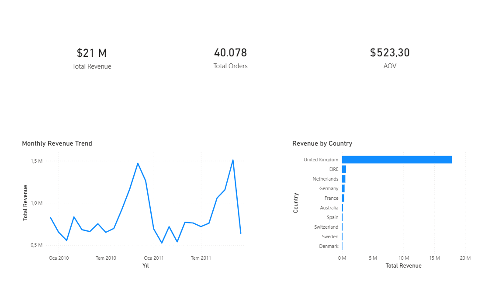

## Dashboard Preview

Retail Sales Executive Dashboard (Power BI)
Project Overview

This project is an executive-level business intelligence dashboard built in Power BI using the Online Retail II dataset.

The objective is to analyze revenue performance, order volume, and purchasing behavior through core KPIs and business-focused visualizations.

Dataset

Online Retail II (UK-based e-commerce dataset)

Contains transactional sales data including:

InvoiceNo

InvoiceDate

Customer ID

Quantity

UnitPrice

Country

Data Preparation

Appended 2009–2010 and 2010–2011 datasets

Removed negative quantities (returns)

Removed zero / negative unit prices

Created calculated column:

Revenue = Quantity × UnitPrice

Clean dataset size: ~1,041,000 rows

KPIs Implemented (Phase 1)

Total Revenue

Total Orders (Distinct Invoice Count)

Average Order Value (AOV)

Visualizations

KPI header section

Monthly revenue trend (Year-Month hierarchy)

Revenue by Country

Current Version

Phase 1 – Core revenue and performance analysis completed.

Next Steps

Customer segmentation (Active / At Risk / Lost)

MoM growth calculation

Retention / Cohort analysis

Executive layout refinement
